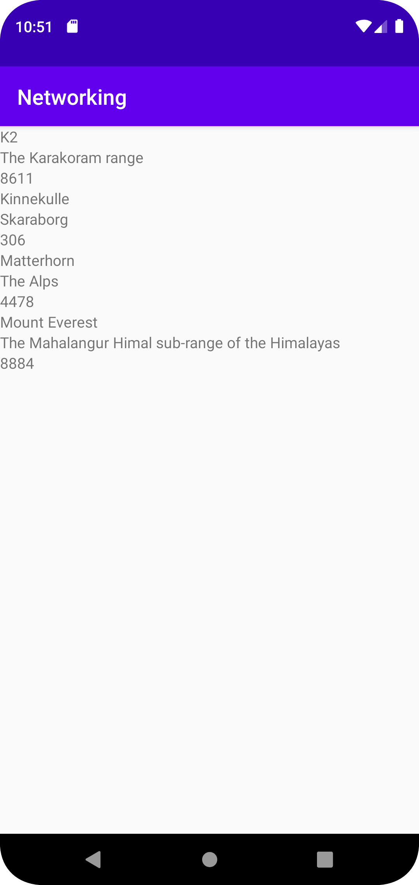

# Rapport

För denna uppgift skapade jag en RecyclerView i filen activity_main.

Figur 1 Kod
```
 protected void onCreate(Bundle savedInstanceState) {
        recyclerView = findViewById(R.id.my_recycler);
        listOfMountain = new ArrayList<Mountain>();
        adapter = new Myadapter(listOfMountain);
        recyclerView.setAdapter(adapter);
        recyclerView.setLayoutManager(new LinearLayoutManager( this));
```


Figur 2 Kod
```
   public void onPostExecute(String json) {

        Gson gson = new Gson();
        Type type = new TypeToken<ArrayList<Mountain>>() {}.getType();
        ArrayList<Mountain> emma = gson.fromJson(json, type);
        listOfMountain.addAll(emma);
        adapter.notifyDataSetChanged();
```

Figur 3 Kod
```
```





